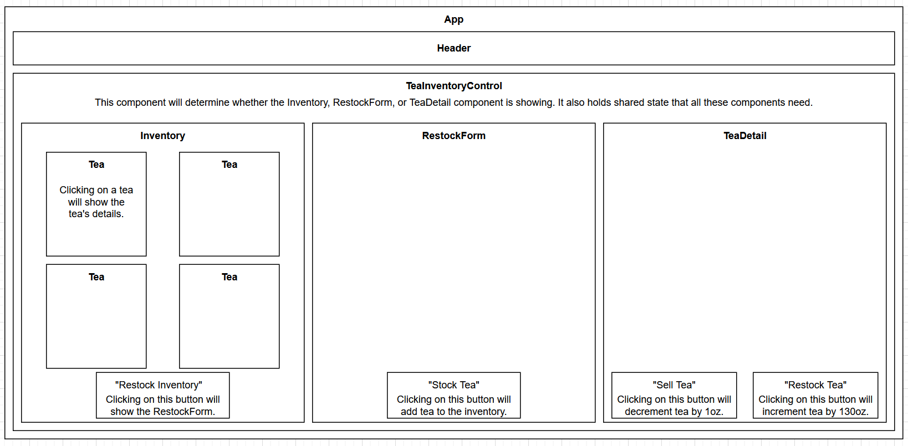

# Tea Inventory Tracker

#### By Richard Barbour II

#### A React single page app using local and shared state to track inventory.

## Technologies Used

Programming Languages:
* [HTML](https://html.spec.whatwg.org/) ([MDN Documentation](https://developer.mozilla.org/en-US/docs/Web/HTML))
* [CSS](https://www.w3.org/TR/CSS/#css) ([MDN Documentation](https://developer.mozilla.org/en-US/docs/Web/CSS))
* [JavaScript](https://ecma-international.org/publications-and-standards/standards/ecma-262/) ([MDN Documentation](https://developer.mozilla.org/en-US/docs/Web/JavaScript)) / [JSX](https://facebook.github.io/jsx/)

Platforms:
* [Node.js](https://nodejs.org/en/) (16.13.1)

Package Managers:
* [npm](https://www.npmjs.com/) (8.1.2)

Libraries:
* [React](https://react.dev/)

## Description

The user can stock the inventory for a tea shop by adding new teas and include the name, origin, type and price. The user can also view the entire selection of teas currently in inventory as well as select individual teas to increase (by 130oz.) or decrease (by 1oz.) the quantity in inventory. 

## Component Diagram

## Setup/Installation Requirements

1. Navigate to https://github.com/rbarcode/w16-inventory-tracker in an internet browser.
2. Click on the green “<> Code” on the far right-hand side of the page's main column.
3. On the “Local” tab of the mini-window that opens underneath the “<>Code” button, copy the HTTPS link in the gray bar to your clipboard.
4. In GitBash (or a terminal shell of your choice), navigate to the directory where you wish to download the project and enter the following prompt (replacing the asterisked word with the appropriate link):\
`git clone *url-of-the-repository-copied-in-the-previous-step*`
5. Your chosen directory will now contain a folder titled w16-inventory-tracker.
6. Navigate into the folder. This is the project's root directory.  
7. After ensuring you have the JavaScript runtime environment Node.js installed on your computer, run the following command from your terminal in the project's root directory:\
`npm install`  

## Available Scripts

To build the project in development mode, run the following command from your terminal in the project's root directory:\
`npm start`

Open [http://localhost:3000](http://localhost:3000) to view it in your browser.

The page will reload when you make changes.\
You may also see any lint errors in the console.

## Known Bugs

No known bugs.

## License

MIT License

Copyright (c) 2023 Richard Barbour II

Permission is hereby granted, free of charge, to any person obtaining a copy of this software and associated documentation files (the "Software"), to deal in the Software without restriction, including without limitation the rights to use, copy, modify, merge, publish, distribute, sublicense, and/or sell copies of the Software, and to permit persons to whom the Software is furnished to do so, subject to the following conditions:

The above copyright notice and this permission notice shall be included in all copies or substantial portions of the Software.

THE SOFTWARE IS PROVIDED "AS IS", WITHOUT WARRANTY OF ANY KIND, EXPRESS OR IMPLIED, INCLUDING BUT NOT LIMITED TO THE WARRANTIES OF MERCHANTABILITY, FITNESS FOR A PARTICULAR PURPOSE AND NONINFRINGEMENT. IN NO EVENT SHALL THE AUTHORS OR COPYRIGHT HOLDERS BE LIABLE FOR ANY CLAIM, DAMAGES OR OTHER LIABILITY, WHETHER IN AN ACTION OF CONTRACT, TORT OR OTHERWISE, ARISING FROM, OUT OF OR IN CONNECTION WITH THE SOFTWARE OR THE USE OR OTHER DEALINGS IN THE SOFTWARE.
